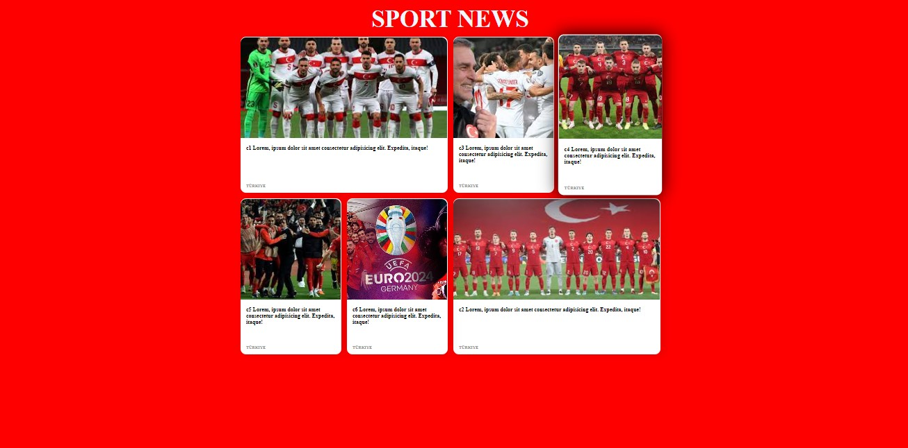

# Sport News Website

This is a simple website template for displaying sports news. It consists of a grid layout showcasing various news articles with images and brief descriptions.

## Table of Contents

- [Description](#description)
- [Features](#features)
- [Screenshots](#screenshots)
- [Live Link](#live-link)
- [Technologies Used](#technologies-used)
- [Usage](#usage)
- [Contributing](#contributing)
- [License](#license)

## Description

The Sport News website template is designed to provide an organized and visually appealing platform for presenting sports-related content. It features a responsive layout that adjusts seamlessly to different screen sizes, making it accessible across various devices.

## Features

- Responsive grid layout for displaying news articles
- Hover effects for improved user interaction
- Optimized for performance and usability
- Media queries for responsiveness across different devices

## Screenshots

## Live Link

[Live Demo](https://grid-css3.vercel.app/) *(Update with your live link)*

## Technologies Used

- HTML5
- CSS3

## Usage

To use this template, follow these steps:

1. Clone this repository to your local machine.
2. Open the `index.html` file in your preferred web browser.
3. Customize the content and styling according to your preferences.
4. Deploy the website to your hosting platform if desired.

## Contributing

Contributions are welcome! If you'd like to enhance this template or fix any issues, feel free to fork the repository and submit a pull request with your changes.

## License

This project is licensed under the [MIT License](LICENSE).
